<h1>Compte Rendu</h1>
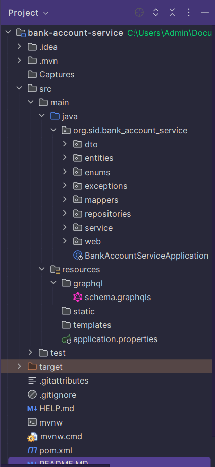
<h2>dto </h2>
<h3>BankAccountRequestDTO :</h3>
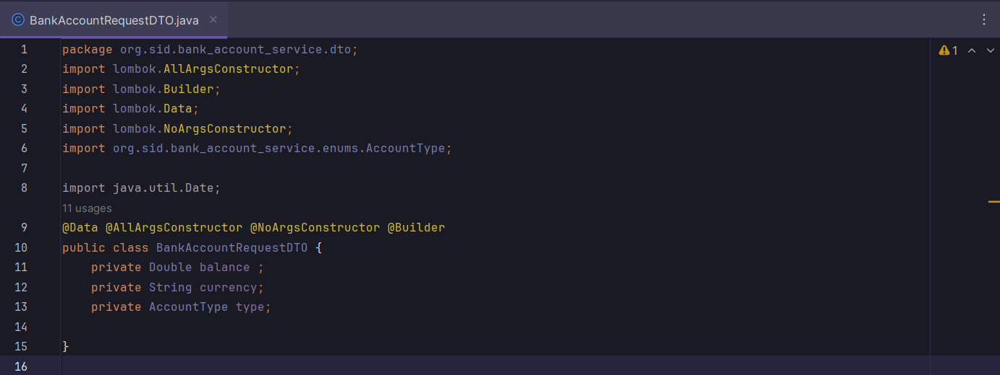
<h3>BankAccountResponseDTO :</h3>
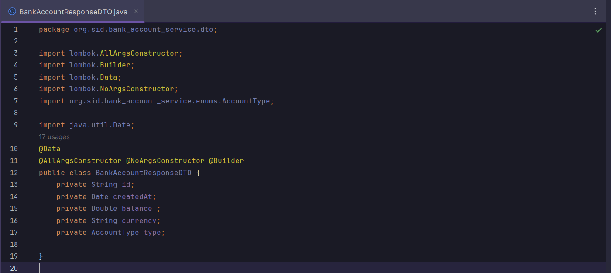

<h2>entities</h2>
<h3>AccountProjection:</h3>
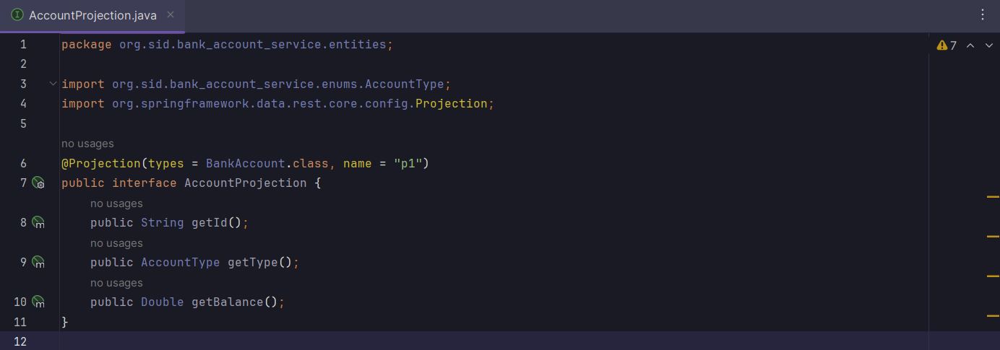
<h3>BankAccount:</h3>
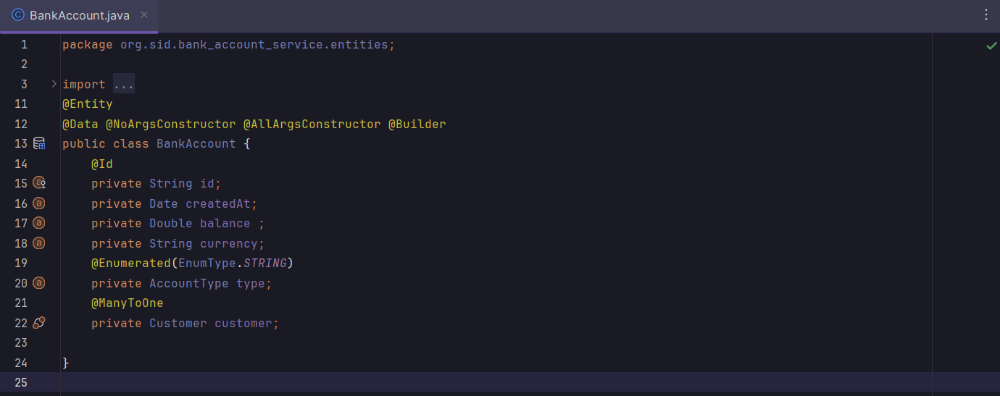
<h3>Customer:</h3>
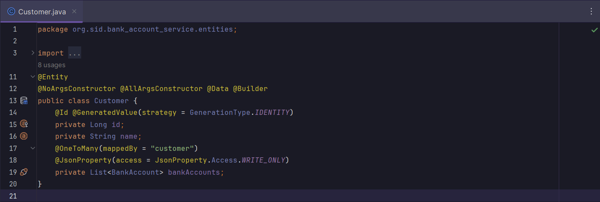

<h2>enums</h2>
<h3>AccountType:</h3>
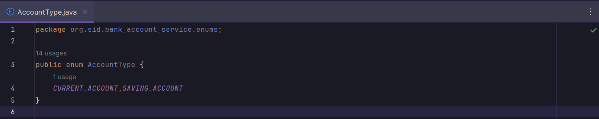

<h2>exceptions</h2>
<h3>CustomDataFetcherExceptionResolver:</h3>
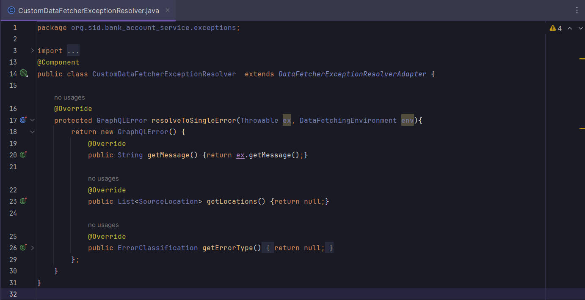

<h2>mappers</h2>
<h3>AccountMapper:</h3>
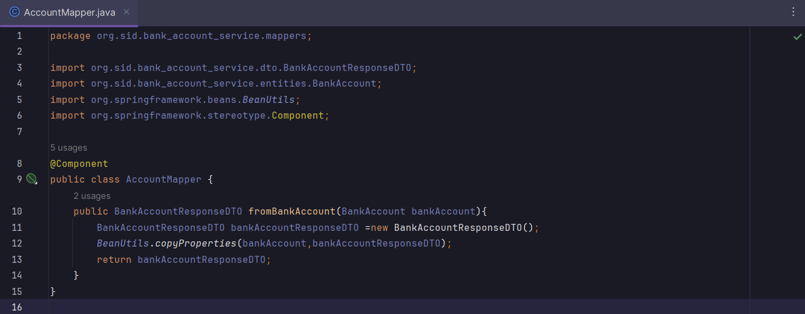

<h2>repositories</h2>
<h3>BankAccountRepository:</h3>
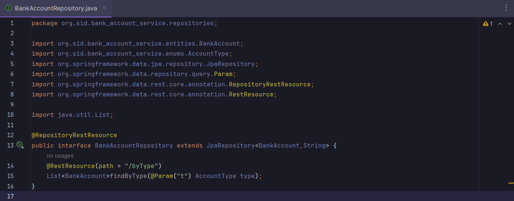
<h3>CustomerRepository:</h3>
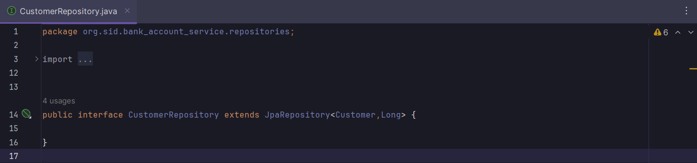

<h2>service</h2>
<h3>AccountService:</h3>
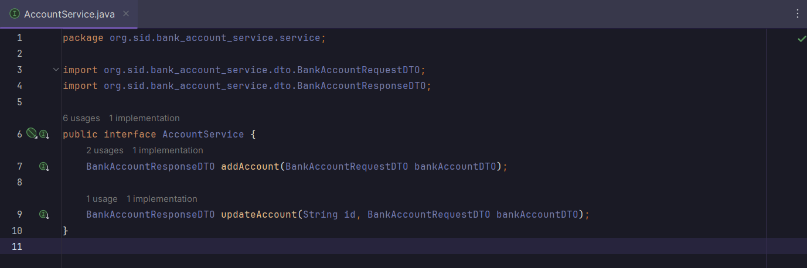
<h3>AccountServiceImpl:</h3>
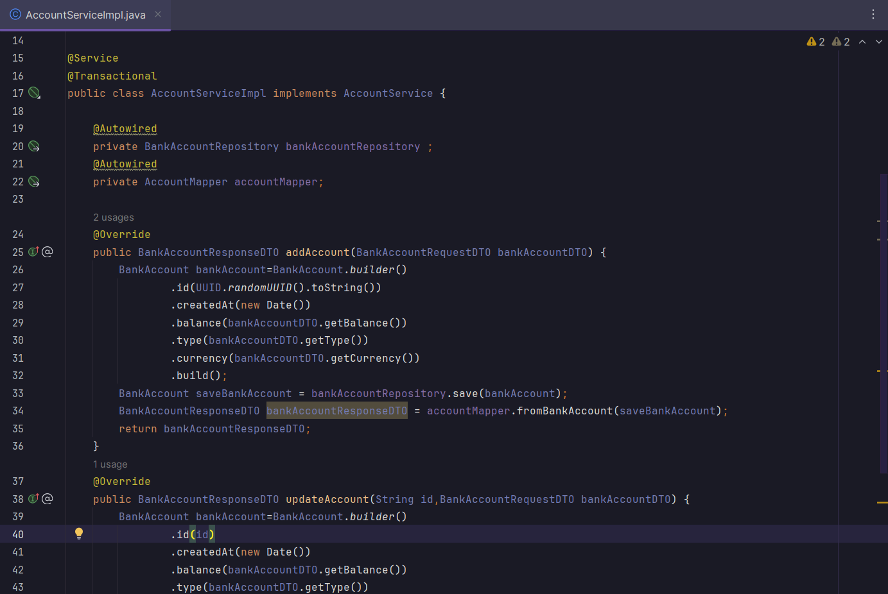

<h2>web</h2>
<h3>AccountRestController:</h3>
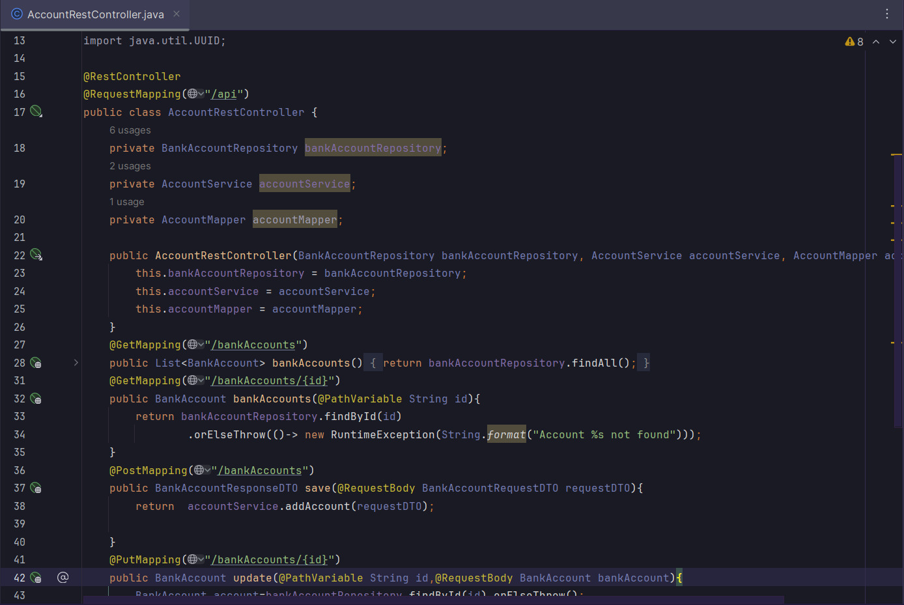
<h3>BankAccountGraphQLController:</h3>
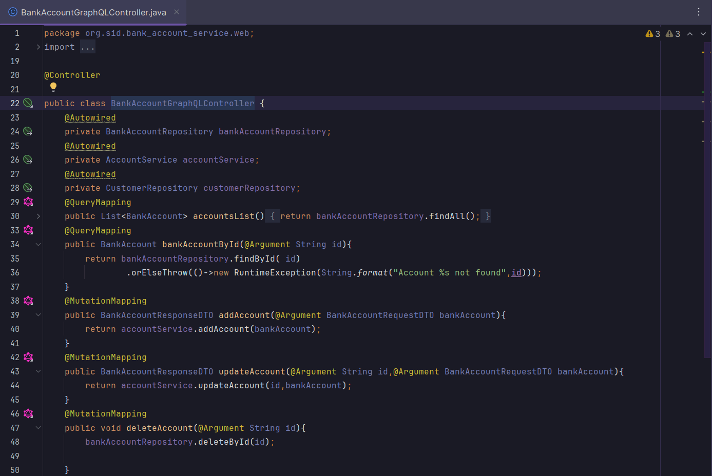

<h2>BankAccountServiceApplication</h2>
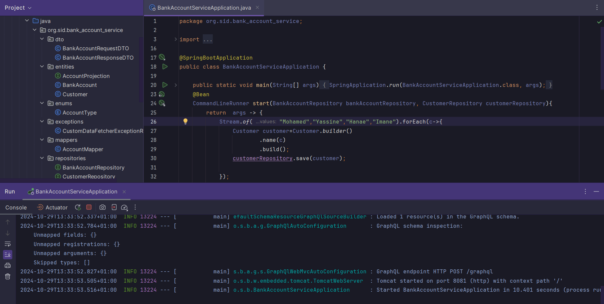

<h2>graphql</h2>
<h3>schema.graphqls:</h3>
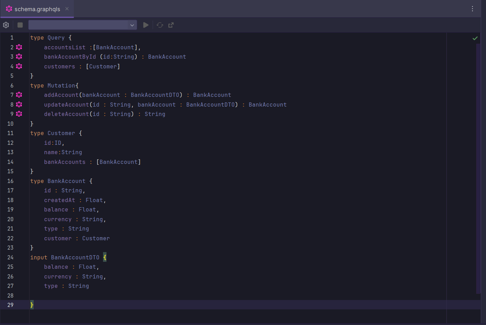

